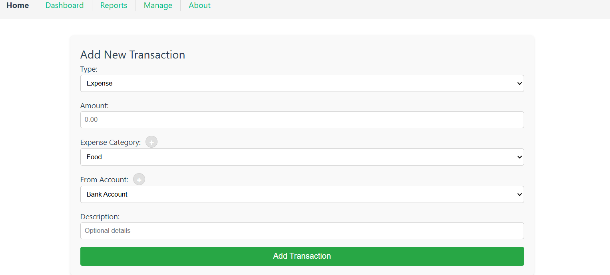
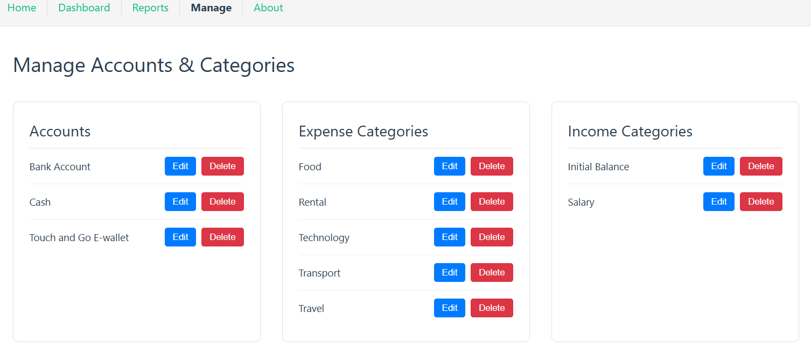
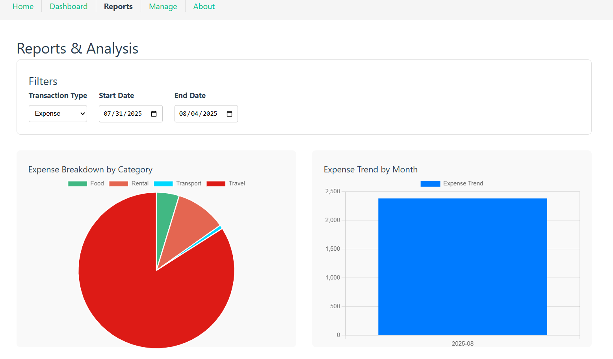

# Personal Financial Tracker

A full-stack, self-hosted web application designed for simple and private personal finance tracking. This application allows you to manage transactions across multiple accounts, track account balances, monitor your net worth, automate recurring entries, budget your spending, and export your data, all while keeping your data securely on your local machine.

## ✨ Features

This app includes a full suite of features for comprehensive financial management:

*   **Secure & Private:** All financial data is stored in a local SQLite database file. No data is ever sent over the internet.
*   **Transaction Management:** Full CRUD (Create, Read, Update, Delete) functionality for all your transactions (Expenses, Income, and Transfers).
*   **Dynamic Management:** Create, edit, and delete your own custom **Accounts** and **Categories** directly from the UI.
*   **Interactive Dashboard:**
    *   Get an at-a-glance view of all your current **Account Balances**.
    *   Track your overall **Net Worth** with a historical line chart that updates daily.
    *   Monitor your monthly spending with a dynamic **Budgeting** overview.
*   **Intelligent Recurring Transactions:**
    *   Define recurring income (e.g., Salary) and expenses (e.g., Rent, Subscriptions).
    *   The system automatically checks on startup and creates any due transactions for the month.
    *   It's smart enough to **not** create a duplicate if you've already manually entered a transaction in the same category for that month.
*   **Advanced Reporting & Data Portability:**
    *   Filter transactions by date range and type.
    *   Visualize spending/income breakdown with a dynamic Pie Chart.
    *   Analyze trends over time with a monthly summary Bar Chart.
    *   Download your filtered transaction data to a `.csv` file for use in spreadsheets such as Excel or Google Sheets.
*   **Pagination:** Smoothly navigate through long lists of transactions on the Home and Reports pages.
*   **Single-Click Launch:** Includes a Windows Batch script to start the server and open the application with one click.

## 📸 Screenshots





## 🛠️ Technology Stack

This project was built using a modern, free, and open-source technology stack:

*   **Backend:**
    *   **Framework:** [FastAPI](https://fastapi.tiangolo.com/) (Python)
    *   **Database:** [SQLite](https://www.sqlite.org/index.html)
    *   **ORM & Migrations:** [SQLAlchemy](https://www.sqlalchemy.org/) & [Alembic](https://alembic.sqlalchemy.org/)
    *   **Data Validation:** [Pydantic](https://pydantic-docs.helpmanual.io/)
*   **Frontend:**
    *   **Framework:** [Vue.js](https://vuejs.org/) (v3)
    *   **Build Tool:** [Vite](https://vitejs.dev/)
    *   **Routing:** [Vue Router](https://router.vuejs.org/)
    *   **Charting:** [Chart.js](https://www.chartjs.org/) with [vue-chartjs](https://vue-chartjs.org/)

## 🚀 Getting Started

Follow these instructions to get a copy of the project up and running on your local machine for development and testing purposes.

### Prerequisites

You will need the following software installed on your machine:

*   [Python](https://www.python.org/downloads/) (version 3.8 or higher)
*   [Node.js](https://nodejs.org/) (which includes npm)

### Installation & Setup

1.  **Clone the repository:**
    ```bash
    git clone https://github.com/chunwei-07/personal-financial-tracker.git
    cd personal-financial-tracker
    ```

2.  **Set up the Backend (Python):**
    *   Navigate to the `backend` directory: `cd backend`
    *   Create and activate a Python virtual environment:
        *   `python -m venv .venv`
        *   Windows: `.\.venv\Scripts\activate`
        *   macOS/Linux: `source .venv/bin/activate`
    *   Install the required Python packages: `uv pip install -r pyproject.toml`

3.  **Set up the Database:**
    *   With your virtual environment activated in the `backend` directory, use Alembic to build the database schema from the migration history:
        ```bash
        alembic upgrade head
        ```
    *   This will create a `financial_tracker.db` file in the project root with all the necessary tables.

4.  **Set up the Frontend (Node.js):**
    *   Navigate to the `frontend` directory: `cd ../frontend`
    *   Install the required npm packages: `npm install`

## 🏃‍♂️ Running the Application

This application is designed to be run as a single, unified server.

1.  **Build the Frontend:**
    First, you need to create a production build of the frontend assets. From the `/frontend` directory, run:
    ```bash
    npm run build
    ```
    This will create a `dist` folder containing the compiled static files.

2.  **Run the Backend Server:**
    Next, start the FastAPI server from the `/backend` directory. The server is configured to serve the frontend you just built.
    ```bash
    cd ../backend
    uvicorn app.main:app --reload
    ```

3.  **Access the Application:**
    Open your web browser and navigate to:
    [http://127.0.0.1:8000](http://127.0.0.1:8000)

The application should be fully functional. The first time you run it, the server will automatically create a `financial_tracker.db` file in the project root and seed it with default accounts and categories.

*(For Windows users, a pre-configured `Launch Financial Tracker.bat` script is included in the root directory for convenience. Remember to edit the `PROJECT_PATH` variable inside the script to match your local setup.)*

## 📝 License

This project is licensed under the **Creative Commons Attribution-NonCommercial 4.0 International License (CC BY-NC 4.0)**.

<a rel="license" href="http://creativecommons.org/licenses/by-nc/4.0/"></a>

This means you are free to:

*   **Share** — copy and redistribute the material in any medium or format
*   **Adapt** — remix, transform, and build upon the material

Under the following terms:

*   **Attribution** — You must give appropriate credit, provide a link to the license, and indicate if changes were made. You may do so in any reasonable manner, but not in any way that suggests the licensor endorses you or your use.
*   **NonCommercial** — You may not use the material for commercial purposes.

You can view the full text of the license [here](http://creativecommons.org/licenses/by-nc/4.0/).
